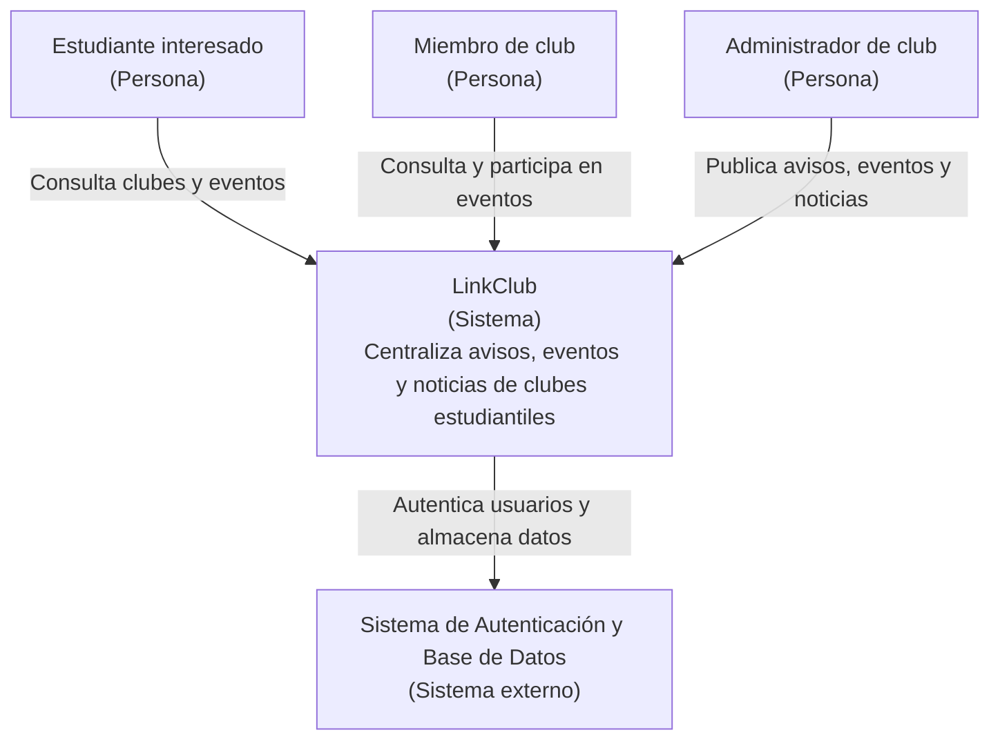

# C4 - Diagrama de Contexto

```mermaid
graph TD
    EI[" Estudiante interesado<br/>(Persona)"] -->|Consulta clubes y eventos| SYS
    MC[" Miembro de club<br/>(Persona)"] -->|Consulta y participa en eventos| SYS
    AC[" Administrador de club<br/>(Persona)"] -->|Publica avisos, eventos y noticias| SYS
    SYS[" LinkClub<br/>(Sistema)<br/>Centraliza avisos, eventos y noticias de clubes estudiantiles"] -->|Autentica usuarios y almacena datos| BD[" Sistema de Autenticación y Base de Datos<br/>(Sistema externo)"]
```
