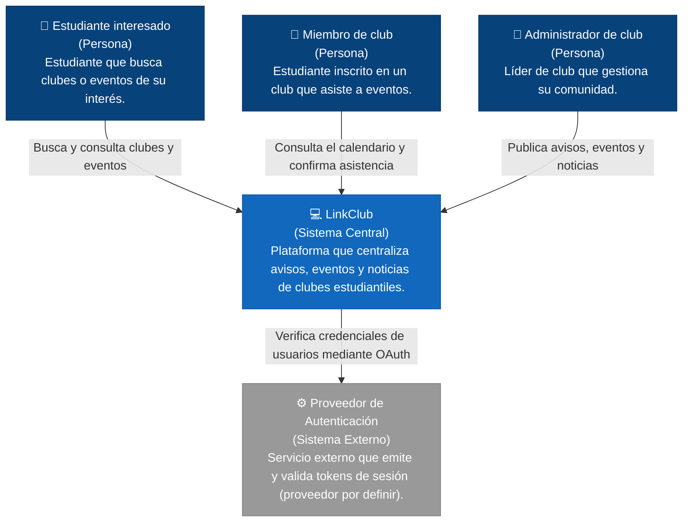

# C4 - Diagrama de Contexto 

```mermaid
graph TD
    %% Estilos visuales basados en el estándar C4
    classDef persona fill:#08427B,stroke:#073B6F,color:#fff;
    classDef sistema fill:#1168BD,stroke:#105EAB,color:#fff;
    classDef externo fill:#999999,stroke:#888888,color:#fff;

    %% Elementos (Personas y Sistemas)
    EI["👤 Estudiante interesado<br/>(Persona)<br/>Estudiante que busca clubes o eventos de su interés."]:::persona
    MC["👤 Miembro de club<br/>(Persona)<br/>Estudiante inscrito en un club que asiste a eventos."]:::persona
    AC["👤 Administrador de club<br/>(Persona)<br/>Líder de club que gestiona su comunidad."]:::persona
    
    SYS["💻 LinkClub<br/>(Sistema Central)<br/>Plataforma que centraliza avisos, eventos y noticias de clubes estudiantiles."]:::sistema
    
     SAE["⚙️ Proveedor de Autenticación<br/>(Sistema Externo)<br/>Servicio externo que emite y valida tokens de sesión (proveedor por definir)."]:::externo

    %% Relaciones e Interacciones
    EI -->|Busca y consulta clubes y eventos| SYS
    MC -->|Consulta el calendario y confirma asistencia| SYS
    AC -->|Publica avisos, eventos y noticias| SYS
    SYS -->|Verifica credenciales de usuarios mediante OAuth| SAE
```

