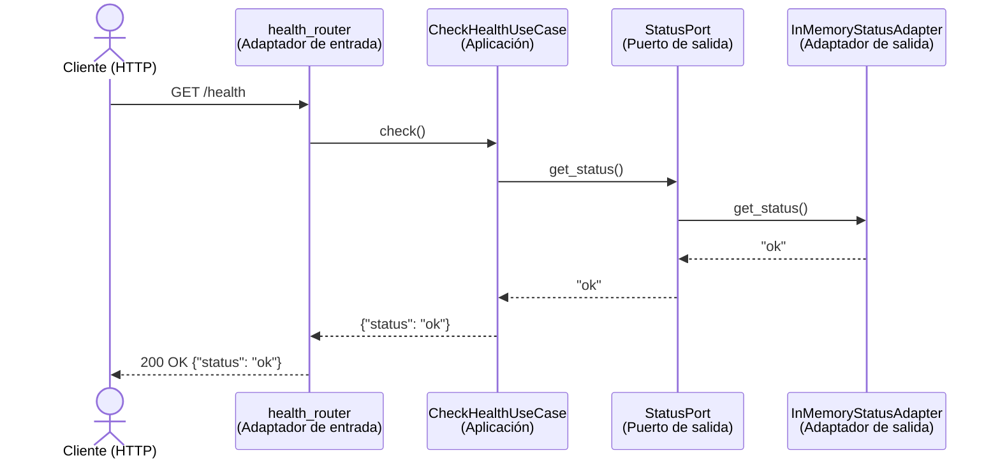

# 6. Vista de ejecución

Esta sección documenta, mediante un diagrama de secuencia, cómo se comporta **LinkClub** en tiempo de ejecución para un escenario concreto y verificable: el único que hoy tiene un corte vertical implementado en el repositorio (interfaz → lógica → persistencia), correspondiente al chequeo de estado del backend.

## 6.1. Escenario documentado: consulta de estado (`GET /health`)

Este es el corte vertical mínimo exigido para esta entrega. Atraviesa las cuatro capas de la arquitectura hexagonal descrita en la [Sección 5](./05_vista_de_bloques.md) y materializa la decisión de diseño registrada en [`docs/adr/0001-hexagonal.md`](../adr/0001-hexagonal.md): la capa de aplicación no conoce el adaptador concreto, solo el puerto `StatusPort`.

## 6.2. Descripción paso a paso

1. El cliente envía `GET /health` al backend FastAPI.
2. El adaptador de entrada (`health_router.py`) recibe la solicitud HTTP y delega en el caso de uso, sin contener lógica de negocio propia.
3. `CheckHealthUseCase` (capa de aplicación) ejecuta `check()`, que a su vez llama a `get_status()` sobre el puerto `StatusPort` — el caso de uso solo conoce la interfaz, no la implementación concreta.
4. El puerto está implementado por `InMemoryStatusAdapter` (adaptador de salida), que en esta entrega retorna un valor fijo `"ok"` en memoria, sin depender todavía de Supabase.
5. La respuesta se propaga de vuelta capa por capa hasta el cliente, que recibe `200 OK` con `{"status": "ok"}`.

Este recorrido está cubierto por la prueba automatizada [`backend/tests/test_health.py`](../../backend/tests/test_health.py), que verifica el código de estado y el cuerpo de la respuesta.

## 6.3. Relación con los escenarios de calidad

Este flujo es la base sobre la que se construirá el manejo de fallos exigido por el escenario **U2 — Disponibilidad** (ver [Sección 10](./10_requisitos_de_calidad.md#escenarios-de-uso)): hoy `InMemoryStatusAdapter` no puede fallar porque no depende de una conexión externa, pero al reemplazarlo por un adaptador real contra Supabase, el manejo de errores de conexión (timeout, reintento, respuesta controlada) se implementará únicamente en el adaptador de salida, sin tocar el caso de uso ni el adaptador de entrada — que es justo lo que exige U2 y lo que motivó la elección de arquitectura hexagonal. Esta decisión pendiente ya está anotada en la [Sección 9](./09_decisiones_de_diseño.md#decisiones-pendientes-de-registrar).