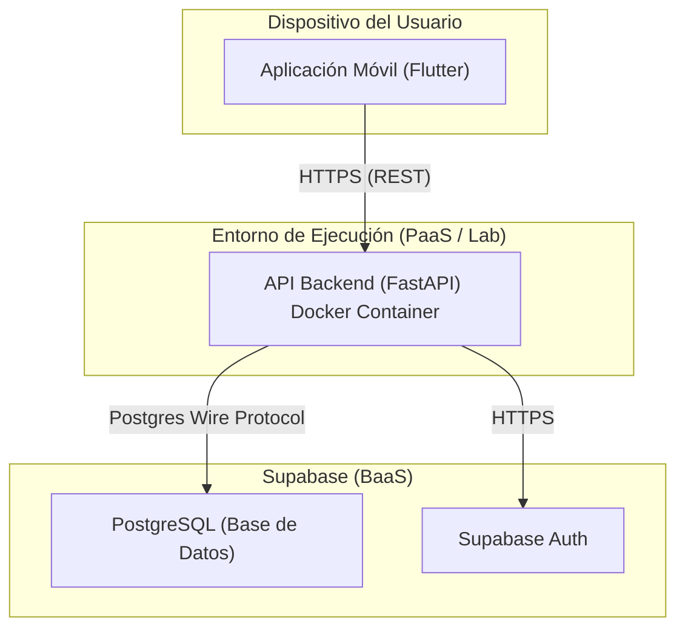

# 7. Vista de Despliegue

La infraestructura de LinkClub está diseñada para operar con un modelo de costo cero mensual durante la fase académica. Se utilizan capas gratuitas (PaaS y BaaS) que cubren holgadamente las estimaciones de tráfico iniciales, manteniendo la flexibilidad de migración mediante el uso de contenedores y tecnologías estándar (FastAPI, PostgreSQL).

## 7.1. Nivel de Infraestructura 1 (Contexto Global de Despliegue)

El entorno de producción se compone de tres nodos principales de ejecución y un servicio de infraestructura como código (pipeline).

| Pieza del Sistema | Entorno de Despliegue | Justificación | Costo Estimado |
|---|---|---|---|
| **Aplicación Móvil (Frontend)** | Dispositivo móvil (Android/iOS) | Ejecución local en el cliente; interactúa vía HTTPS. | $0 |
| **API Backend (FastAPI)** | Azure Container Apps | Ejecuta la lógica de negocio; requiere latencia predecible. | $0 |
| **Base de Datos y Auth** | Supabase (US East) | Servicio PostgreSQL gestionado; exime al equipo de operaciones de BD. Decisión [ADR-0004](../docs/adr/0004-despliegue-base-de-datos.md). | $0 (Capa gratuita) |
| **Pipeline CI/CD** | GitHub Actions | Ejecuta tests y análisis de código estático de forma automatizada. | $0 |

## 7.2. Nivel de Infraestructura 2 (Detalle de Piezas)

### 7.2.1. Base de Datos (Supabase)

La persistencia de datos (usuarios, clubes, publicaciones y eventos) se delega a Supabase, que actúa como nuestro proveedor BaaS (Backend as a Service).

* **Supuestos de uso (Tráfico mensual UTB):** Se estima una base activa de 2,000 estudiantes (MAU). Con un promedio de 2 visitas semanales y 10 operaciones por visita, se estiman 160,000 consultas SQL mensuales. El almacenamiento primario (texto y UUIDs) se estima en ~50 MB mensuales.
* **Punto de ruptura de la capa gratuita:** La capa gratuita de Supabase (Plan Free) permite hasta **500 MB** de base de datos y **50,000 MAU**.
* **Análisis de Costo:** Con 50 MB y 2,000 MAU, el proyecto opera cómodamente dentro de la capa gratuita, resultando en un costo de **$0**. Si la aplicación creciera y superara los 500 MB, el costo ascendería a $25/mes (Plan Pro).
* **Justificación de Despliegue:** [ADR-0004](../docs/adr/0004-despliegue-base-de-datos.md) documenta la decisión de preferir este servicio gestionado frente a un contenedor PostgreSQL local, mitigando los riesgos operativos (backups, caídas del servidor del laboratorio).
* **Reversibilidad:** En caso de que se elimine la capa gratuita, se extraerán los datos mediante `pg_dump`. Al utilizar PostgreSQL estándar, la API solo requerirá actualizar las variables de entorno necesarias para apuntar a un nuevo contenedor en el servidor del laboratorio.
