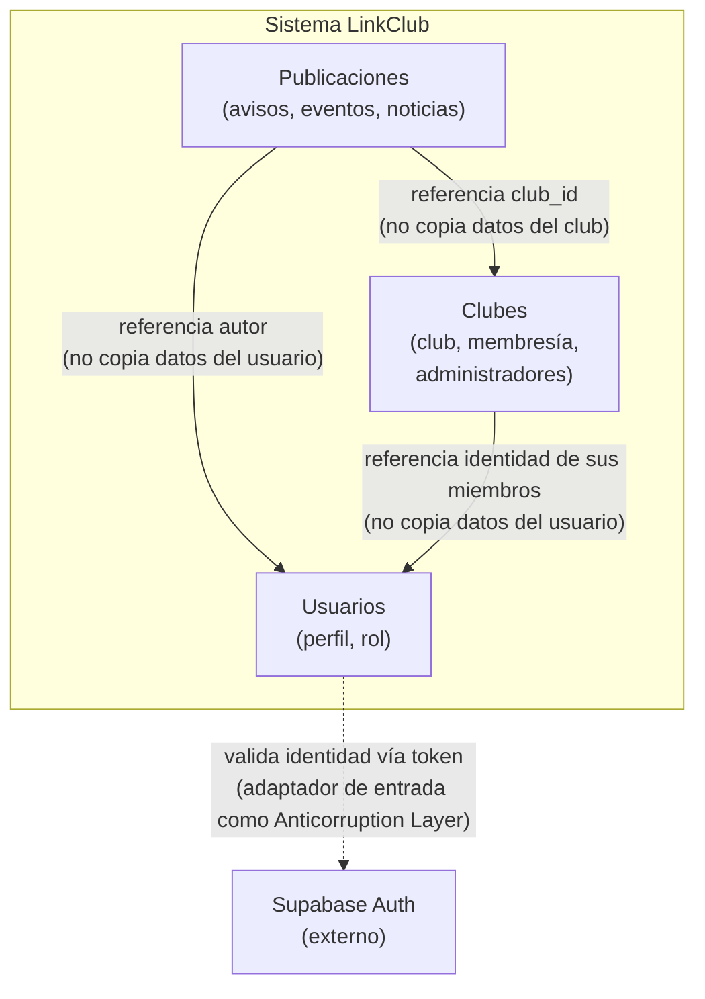

# 8. Conceptos transversales

[#8-conceptos-transversales](#8-conceptos-transversales)

Esta sección reúne los conceptos que atraviesan varios módulos de **LinkClub** y que, por eso mismo, deben tener un significado único y consistente en todo el sistema: el lenguaje ubicuo compartido por el equipo y los contextos delimitados que separan ese lenguaje cuando dos contextos usan la misma palabra con matices distintos.

## 8.1. Lenguaje ubicuo

[#81-lenguaje-ubicuo](#81-lenguaje-ubicuo)

El lenguaje ubicuo se organiza por contexto delimitado (ver 8.2), porque algunos términos cambian de significado o de nivel de detalle según el contexto que los usa. Cuando un término es ambiguo entre contextos, se aclara explícitamente en la columna "Notas".

### Contexto Usuarios

| Término | Definición | Notas |
|---|---|---|
| Usuario | Persona registrada en LinkClub, dueña de un perfil (nombre, matrícula, rol). | Es el único contexto que almacena el perfil completo; los demás solo lo referencian por identidad. |
| Rol | Nivel de permisos de un usuario dentro del sistema (p. ej. estudiante, administrador de club). | No debe confundirse con "Administrador de club" (ver contexto Clubes): el rol es un atributo del usuario, no una relación de membresía. |
| Identidad | Referencia mínima a un usuario (su ID) que otros contextos usan para apuntar a él sin copiar su perfil. | Es lo único que Clubes y Publicaciones conocen de un usuario. |
| Sesión / Token | Credencial vigente emitida tras validar identidad contra el proveedor de autenticación. | Pertenece conceptualmente al límite con Supabase Auth, no al perfil en sí. |

### Contexto Clubes

| Término | Definición | Notas |
|---|---|---|
| Club | Agrupación estudiantil con nombre, categoría, descripción e imagen. | Dueño único de estos datos: el contexto Clubes (ver 8.2 y `tabla_modulo.md`). |
| Miembro | Usuario vinculado a un club como parte de su comunidad. | Clubes almacena la relación de membresía, **no** el perfil del miembro; el perfil vive en Usuarios. |
| Administrador de club | Miembro con permiso para gestionar el club (publicar en su nombre, editar su información). | Es un rol *dentro* de la relación de membresía de un club específico, distinto del "Rol" global de Usuarios. |

### Contexto Publicaciones

| Término | Definición | Notas |
|---|---|---|
| Publicación | Elemento de comunicación emitido en nombre de un club: agrupa avisos, eventos y noticias. | Es el concepto raíz de este contexto; toda escritura pasa por aquí (`crear_publicacion.py`). |
| Aviso / Evento / Noticia | Subtipos de publicación con datos propios (p. ej. un evento tiene fecha y lugar). | Hoy en el código solo existe la entidad genérica `Publicacion`; la diferenciación por subtipo aún no está implementada. |
| Autor | Referencia a la identidad del usuario que originó la publicación. | Publicaciones no guarda el perfil del autor, solo su identidad (ver Usuarios). |

## 8.2. Mapa de contextos delimitados

[#82-mapa-de-contextos-delimitados](#82-mapa-de-contextos-delimitados)

LinkClub se divide en tres contextos internos y un contexto externo. El detalle completo de la fundamentación de cada frontera está en [`mapa-contextos-fundamentacion.md`](mapa-contextos-fundamentacion.md); aquí se resume lo esencial para efectos de esta sección.

| Contexto | Tipo | Relación con los demás | Tipo de relación (DDD) |
|---|---|---|---|
| Usuarios | Interno | Es referenciado por Clubes y Publicaciones | Núcleo compartido (identidad como referencia, no como copia) |
| Clubes | Interno | Referencia a Usuarios; es referenciado por Publicaciones | Cliente de Usuarios / proveedor de Publicaciones |
| Publicaciones | Interno | Referencia a Clubes y a Usuarios | Cliente-proveedor (consume, no escribe en los otros dos) |
| Supabase Auth | Externo | Es consultado por Usuarios | Capa anticorrupción (ACL) — el dominio de Usuarios no depende del formato de token de Supabase |

**Regla que atraviesa los tres contextos internos:** ningún contexto copia datos que no le pertenecen; solo guarda la referencia (ID) al dueño real del dato. Esta regla es la que sostiene la tabla de propiedad de datos (`tabla_modulo.md`) y es también el criterio que se usó para detectar las violaciones registradas en `lista_errores.md` (p. ej. NC-01: la app móvil hoy tiene datos de clubes hardcodeados en `clubs_page.dart` en vez de consumirlos del contexto Clubes).

## 8.3. Punto abierto: alineación con la tabla de módulos

[#83-punto-abierto-alineación-con-la-tabla-de-módulos](#83-punto-abierto-alineación-con-la-tabla-de-módulos)

`tabla_modulo.md` nombra los módulos como **Usuario, Clubes, Actividades, Notificaciones**, mientras que el mapa de contextos de esta sección usa **Usuarios, Clubes, Publicaciones**. "Actividades" y "Notificaciones" no están implementados en el código actual (solo existe la entidad `Publicacion`) y no tienen un contexto delimitado propio todavía. Este desajuste queda registrado aquí como pendiente: `tabla_modulo.md` debe actualizarse para usar los tres contextos de esta sección como única fuente de verdad, o bien justificarse por qué Actividades/Notificaciones ameritan ser un cuarto contexto — decisión que, de tomarse, debe documentarse en un ADR nuevo (ver evidencia S6).
