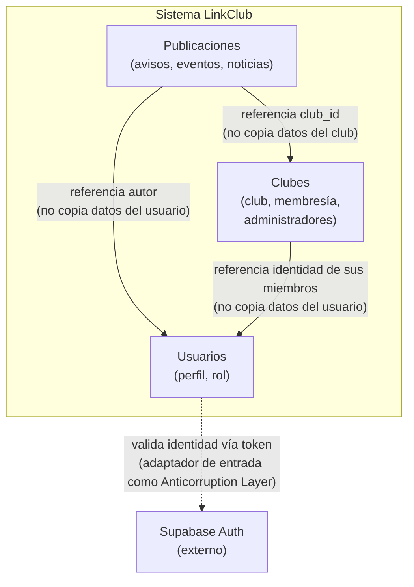

# Mapa de contextos - LinkClub

## Contextos identificados

LinkClub se organiza en tres contextos internos (subdominios del propio sistema, delimitados por responsabilidad de negocio) y un contexto externo (fuera del control del equipo).

| Contexto | Tipo | Responsabilidad de negocio |
|---|---|---|
| **Clubes** | Interno | Gestiona la existencia de cada club y su membresía: quién pertenece a qué club, quién lo administra |
| **Publicaciones** | Interno | Gestiona avisos, eventos y noticias publicados en nombre de un club |
| **Usuarios** | Interno | Gestiona la identidad y el perfil de cada persona dentro del sistema (nombre, matrícula, rol) |
| **Supabase Auth** | Externo | Valida credenciales y emite tokens de sesión; sus reglas internas no las define LinkClub |

## Diagrama

## Relaciones entre contextos

**Clubes - Usuarios (referencia, no copia).** El contexto Clubes es dueño de la relación de membresía: cada club mantiene su propia lista de miembros. Esa lista no contiene copias de los datos personales de cada usuario, solo una referencia a su identidad (los datos completos del perfil siguen viviendo únicamente en el contexto Usuarios).

**Publicaciones - Clubes (referencia).** Cada publicación pertenece a exactamente un club, identificado por `club_id`. Publicaciones no almacena ninguna información propia del club (nombre, descripción); solo la referencia.

**Publicaciones - Usuarios (referencia).** Cada publicación tiene un autor. Publicaciones no almacena el perfil de quien publicó, solo la referencia a su identidad.

**Usuarios - Supabase Auth (Anticorruption Layer).** Este es el único límite del sistema hacia un contexto externo real. Supabase Auth define sus propias reglas de token y credenciales, sobre las que LinkClub no tiene control. La traducción entre el mundo de Supabase Auth y el modelo interno de Usuarios ocurre en un adaptador de entrada específico (capa de infraestructura, arquitectura hexagonal ADR 0001), que actúa como capa anticorrupción: el dominio de Usuarios nunca depende directamente del formato de token de Supabase.

_Nota: Este diagrama modela únicamente conceptos de negocio y fronteras reales de control. Flutter y FastAPI son las tecnologías con las que se construye LinkClub, la interfaz y el backend *son* el sistema, no algo externo a él. La base de datos (alojada en Supabase, ya definida en la restricción T3/T4 cerrada) es un detalle de infraestructura interno a cada contexto: cada uno de los tres contextos internos (Clubes, Publicaciones, Usuarios) es responsable de persistir sus propios datos, sin que eso constituya un contexto ni un actor aparte._
