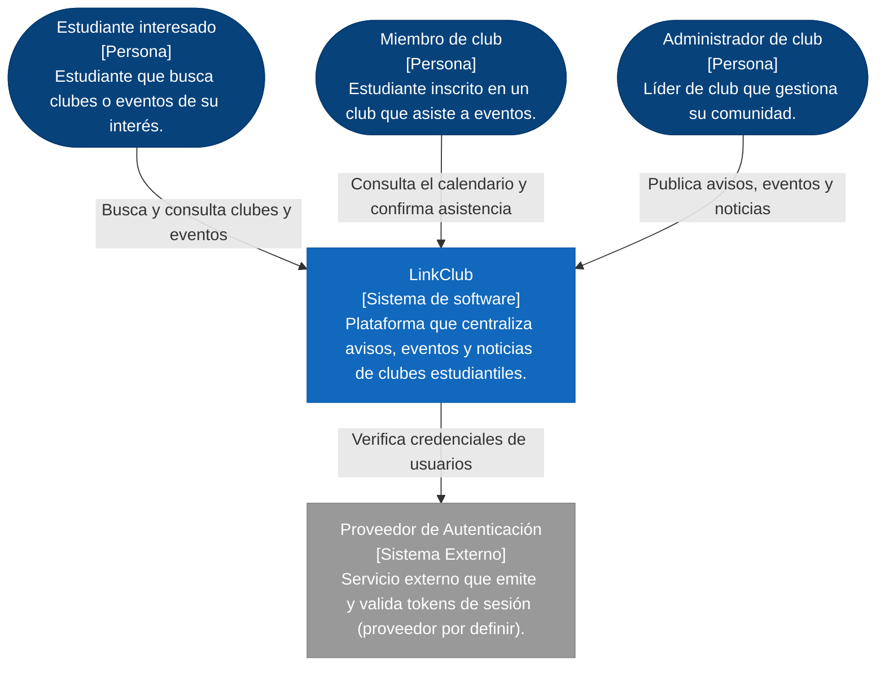
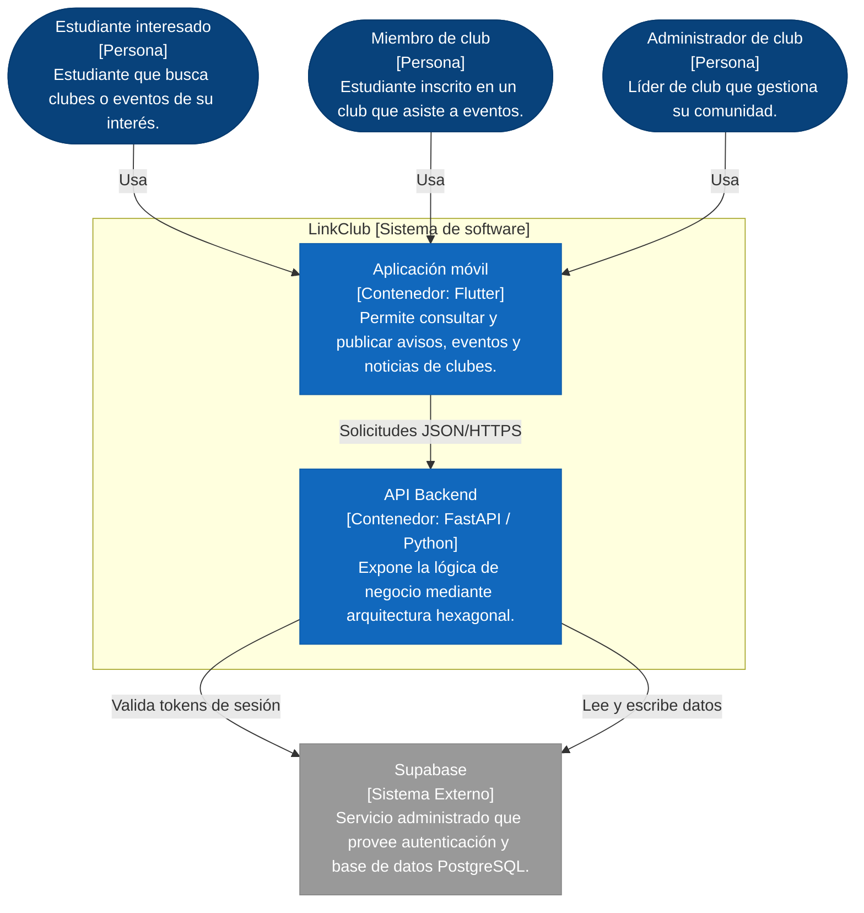

# C4 - Diagrama de Contexto

```mermaid
graph TD
    classDef persona fill:#08427B,stroke:#073B6F,color:#fff;
    classDef sistema fill:#1168BD,stroke:#105EAB,color:#fff;
    classDef externo fill:#999999,stroke:#888888,color:#fff;

    EI(["Estudiante interesado<br/>[Persona]<br/>Estudiante que busca clubes o eventos de su interés."]):::persona
    MC(["Miembro de club<br/>[Persona]<br/>Estudiante inscrito en un club que asiste a eventos."]):::persona
    AC(["Administrador de club<br/>[Persona]<br/>Líder de club que gestiona su comunidad."]):::persona

    SYS["LinkClub<br/>[Sistema de software]<br/>Plataforma que centraliza avisos, eventos y noticias de clubes estudiantiles."]:::sistema

    SAE["Proveedor de Autenticación<br/>[Sistema Externo]<br/>Servicio externo que emite y valida tokens de sesión (proveedor por definir)."]:::externo

    EI -->|Busca y consulta clubes y eventos| SYS
    MC -->|Consulta el calendario y confirma asistencia| SYS
    AC -->|Publica avisos, eventos y noticias| SYS
    SYS -->|Verifica credenciales de usuarios| SAE
```
# C4 - Diagrama de Contenedores

```mermaid
graph TD
    classDef persona fill:#08427B,stroke:#073B6F,color:#fff;
    classDef contenedor fill:#1168BD,stroke:#105EAB,color:#fff;
    classDef externo fill:#999999,stroke:#888888,color:#fff;

    EI(["Estudiante interesado<br/>[Persona]<br/>Estudiante que busca clubes o eventos de su interés."]):::persona
    MC(["Miembro de club<br/>[Persona]<br/>Estudiante inscrito en un club que asiste a eventos."]):::persona
    AC(["Administrador de club<br/>[Persona]<br/>Líder de club que gestiona su comunidad."]):::persona

    subgraph SYS["LinkClub [Sistema de software]"]
        APP["Aplicación móvil<br/>[Contenedor: Flutter]<br/>Permite consultar y publicar avisos, eventos y noticias de clubes."]:::contenedor
        API["API Backend<br/>[Contenedor: FastAPI / Python]<br/>Expone la lógica de negocio mediante arquitectura hexagonal."]:::contenedor
    end

    SUPA["Supabase<br/>[Sistema Externo]<br/>Servicio administrado que provee autenticación y base de datos PostgreSQL."]:::externo

    EI -->|Usa| APP
    MC -->|Usa| APP
    AC -->|Usa| APP

    APP -->|Solicitudes JSON/HTTPS| API
    API -->|Valida tokens de sesión| SUPA
    API -->|Lee y escribe datos| SUPA
```

