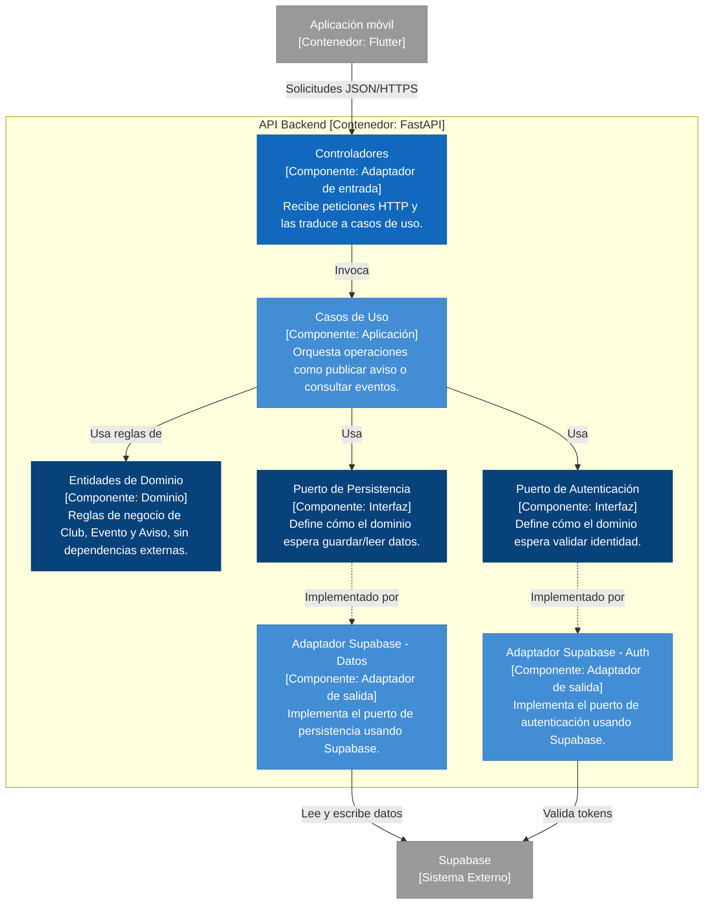

# C4 - Diagrama de Contexto

```mermaid
graph TD
    classDef persona fill:#08427B,stroke:#073B6F,color:#fff;
    classDef sistema fill:#1168BD,stroke:#105EAB,color:#fff;
    classDef externo fill:#999999,stroke:#888888,color:#fff;

    EI(["Estudiante interesado<br/>[Persona]<br/>Estudiante que busca clubes o eventos de su interés."]):::persona
    MC(["Miembro de club<br/>[Persona]<br/>Estudiante inscrito en un club que asiste a eventos."]):::persona
    AC(["Administrador de club<br/>[Persona]<br/>Líder de club que gestiona su comunidad."]):::persona

    SYS["LinkClub<br/>[Sistema de software]<br/>Plataforma que centraliza avisos, eventos y noticias de clubes estudiantiles."]:::sistema

    SAE["Proveedor de Autenticación<br/>[Sistema Externo]<br/>Servicio externo que emite y valida tokens de sesión (proveedor por definir)."]:::externo

    EI -->|Busca y consulta clubes y eventos| SYS
    MC -->|Consulta el calendario y confirma asistencia| SYS
    AC -->|Publica avisos, eventos y noticias| SYS
    SYS -->|Verifica credenciales de usuarios| SAE
```
# C4 - Diagrama de Contenedores

```mermaid
graph TD
    classDef persona fill:#08427B,stroke:#073B6F,color:#fff;
    classDef contenedor fill:#1168BD,stroke:#105EAB,color:#fff;
    classDef externo fill:#999999,stroke:#888888,color:#fff;

    EI(["Estudiante interesado<br/>[Persona]<br/>Estudiante que busca clubes o eventos de su interés."]):::persona
    MC(["Miembro de club<br/>[Persona]<br/>Estudiante inscrito en un club que asiste a eventos."]):::persona
    AC(["Administrador de club<br/>[Persona]<br/>Líder de club que gestiona su comunidad."]):::persona

    subgraph SYS["LinkClub [Sistema de software]"]
        APP["Aplicación móvil<br/>[Contenedor: Flutter]<br/>Permite consultar y publicar avisos, eventos y noticias de clubes."]:::contenedor
        API["API Backend<br/>[Contenedor: FastAPI / Python]<br/>Expone la lógica de negocio mediante arquitectura hexagonal."]:::contenedor
    end

    SUPA["Supabase<br/>[Sistema Externo]<br/>Servicio administrado que provee autenticación y base de datos PostgreSQL."]:::externo

    EI -->|Usa| APP
    MC -->|Usa| APP
    AC -->|Usa| APP

    APP -->|Solicitudes JSON/HTTPS| API
    API -->|Valida tokens de sesión| SUPA
    API -->|Lee y escribe datos| SUPA
```

# C4 - Diagrama de Componentes (API Backend)

```mermaid
graph TD
    classDef entrada fill:#1168BD,stroke:#105EAB,color:#fff;
    classDef app fill:#438DD5,stroke:#3878B4,color:#fff;
    classDef dominio fill:#08427B,stroke:#073B6F,color:#fff;
    classDef salida fill:#438DD5,stroke:#3878B4,color:#fff;
    classDef externo fill:#999999,stroke:#888888,color:#fff;

    APP_MOVIL["Aplicación móvil<br/>[Contenedor: Flutter]"]:::externo

    subgraph API["API Backend [Contenedor: FastAPI]"]
        CTRL["Controladores<br/>[Componente: Adaptador de entrada]<br/>Recibe peticiones HTTP y las traduce a casos de uso."]:::entrada

        UC["Casos de Uso<br/>[Componente: Aplicación]<br/>Orquesta operaciones como publicar aviso o consultar eventos."]:::app

        DOM["Entidades de Dominio<br/>[Componente: Dominio]<br/>Reglas de negocio de Club, Evento y Aviso, sin dependencias externas."]:::dominio

        PUERTO_DATA["Puerto de Persistencia<br/>[Componente: Interfaz]<br/>Define cómo el dominio espera guardar/leer datos."]:::dominio
        PUERTO_AUTH["Puerto de Autenticación<br/>[Componente: Interfaz]<br/>Define cómo el dominio espera validar identidad."]:::dominio

        ADAPT_DATA["Adaptador Supabase - Datos<br/>[Componente: Adaptador de salida]<br/>Implementa el puerto de persistencia usando Supabase."]:::salida
        ADAPT_AUTH["Adaptador Supabase - Auth<br/>[Componente: Adaptador de salida]<br/>Implementa el puerto de autenticación usando Supabase."]:::salida
    end

    SUPA["Supabase<br/>[Sistema Externo]"]:::externo

    APP_MOVIL -->|Solicitudes JSON/HTTPS| CTRL
    CTRL -->|Invoca| UC
    UC -->|Usa reglas de| DOM
    UC -->|Usa| PUERTO_DATA
    UC -->|Usa| PUERTO_AUTH
    PUERTO_DATA -.->|Implementado por| ADAPT_DATA
    PUERTO_AUTH -.->|Implementado por| ADAPT_AUTH
    ADAPT_DATA -->|Lee y escribe datos| SUPA
    ADAPT_AUTH -->|Valida tokens| SUPA
```
